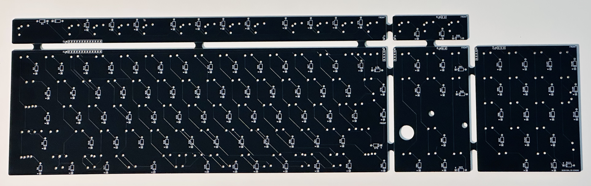
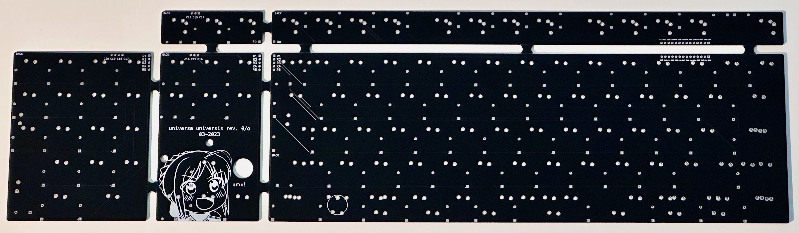

# Universa Universis
Retrofit PCB for various Alps full-sized keyboards.

## Planned support:
- AEK (ANSI, EUR, JPN)
- DELL AT101W (ANSI, EUR, JPN)
- DELL AT101 (ANSI, EUR, JPN)
- Strong Man SMK-8851 (BAE, JPN)

## Version History:

### Alpha Revision

Front:

Back:

#### Known Issues
- DELL AT101 support impeded by unpopable popout between RAlt and RCtrl.
- ISO Enter in wrong position (1.5u vs. 1u); can fold down leads of switch to compensate.
- Num pad plus and enter key switches flipped 90 degrees.
- No LED carrier board.
